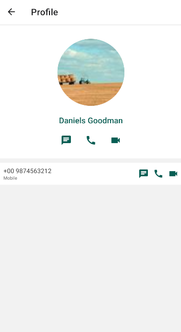
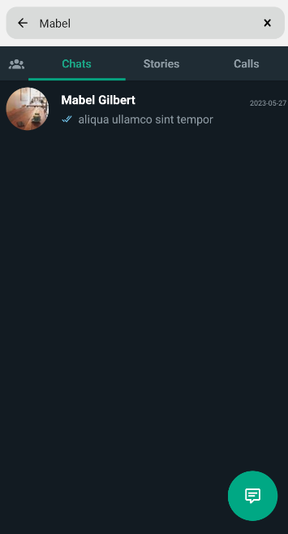

## Features

- Chats
- Stories - Status
- Calls
- Messages - "when you press a message" : You can send a message but it doesn't store.
- Profile
- Search

## Screenshots

1. 
1. 
1. 
1. 
1. 
1. 
1. 
1. 

## Initial Setup

1. Install the package

```bash
npm install
```

Make sure to run npm install to install the package.

2. Run the application

```bash
npm run android
```

or if want to open metro 

```bash
npm start
```
